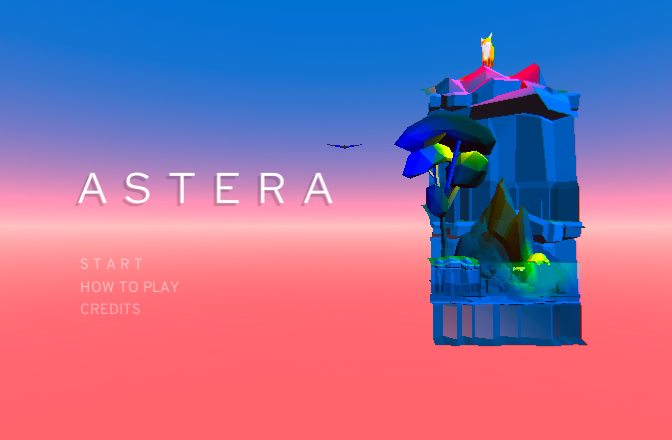

# Astera

Astera is a low poly 2D platformer written in C# and created with the Unity game engine. 

 

Play it [here!](http://pseudologica.herokuapp.com/astera.html) (http://pseudologica.herokuapp.com/astera.html)

## Story

A mysterious forest on the outskirts of humanity greets the sun as it does every day. However, you, a young kitten, are a new addition to the woods, unsure of where you are or how to get home. As you wander through the twists and turns of this unfamiliar place, you discover that there is more to the strange energy of it than meets the eye.

## Three Levels

Play each level to experience a unique atmosphere and gain a new ability. There are a total of three levels—bird, turtle, and fox.

 
 
 

## Credits
Game by Shawn Agustin, Kasen Chaque, Sandra Soto, Kati Tran, and Weixuan Tan
Website by Yingyan Wu

## License
[MIT](https://choosealicense.com/licenses/mit/)